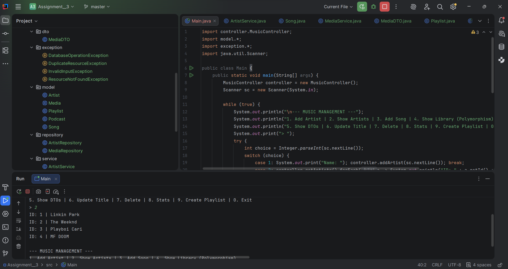
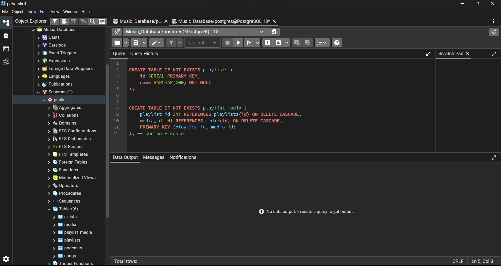

Advanced Music Library API 

A. Project Overview
Purpose:

This project is a Java-based REST-like API (Console Version) designed to manage a Music Library. 
It allows users to manage artists, songs, podcasts, and playlists using a persistent PostgreSQL database.

Summary of Entities:
Artist: Represents the creator of music.
Media (Abstract): The base class for all playable content.
Song: A type of media linked to an Artist and a Genre.
Podcast: A type of media linked to a Host.
Playlist: A collection that aggregates multiple Media items.

OOP Design Documentation
Abstraction: The Media class is abstract and defines the core structure (id, title, duration) and abstract methods like displayDetails().
Inheritance: Song and Podcast extend Media, inheriting common attributes while adding specific ones (Genre, Host).
Polymorphism: The system handles a List<Media>, where calling displayDetails() triggers the specific implementation of either a Song or a Podcast at runtime.
Interfaces:
Playable: Implemented by Song to simulate playback.
Downloadable: Implemented by Song to simulate offline access.
Composition/Aggregation:
A Song contains an Artist object (Composition).
A Playlist contains a List<Media> (Aggregation).

C. Database Description
Schema & Constraints:
artists: Stores unique artist names with a Primary Key.
media: Base table for all media (Primary Key).
songs: Linked to media (FK) and artists (FK) using ON DELETE CASCADE.
playlists: Stores playlist names.
playlist_media: Junction table for Many-to-Many relationship between Playlists and Media.

D. Controller Summary
The MusicController serves as the entry point for the CLI, exposing:
addArtist(String name): Validates and saves a new artist.
addMedia(Media m): Adds a Song or Podcast to the DB.
getLibrary(): Returns all media using Polymorphism.
getDTOs(): Demonstrates the use of Data Transfer Objects for formatted output.
getStats(): Provides library statistics (total tracks/time).

